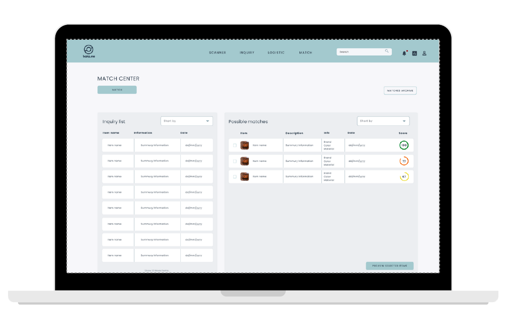

import logo from '@/images/clients/bak2.me/logobak2me.svg'
import imageHero from './hero.jpg'

export const caseStudy = {
  active: true,
  client: 'Bak2.me',
  title: 'Приложение для поиска утерянных вещей по всему миру',
  description:
    'Bak2.me – приложение для поиска утерянных вещей по всему миру. Позволяет пользователям найти в базе данных свои вещи или отправить запрос на поиск.',
    // 'FamilyFund is a crowdfunding platform for friends and family. Allowing users to take personal loans from their network without a traditional financial institution.',
  summary: [
    'Bak2.me – приложение для поиска утерянных вещей по всему миру. Позволяет пользователям найти в базе данных свои вещи или отправить запрос на поиск.',
    // 'We developed a custom CMS to power their blog with and optimised their site to rank higher for the keywords “Gary Vee” and “Tony Robbins”.',
  ],
  logo,
  image: { src: imageHero },
  date: '2023',
  service: 'Веб-разработка',
}

export const metadata = {
  title: `Проект ${caseStudy.client}`,
  description: caseStudy.description,
}

## Описание проекта

Цель проекта - создать всемирную сеть бюро находок и увеличить процент возврата утерянных вещей до 90%.

### Ключевые составляющие проекта:

Разумное потребление: Возврат старых вещей останавливает людей от покупки новых. Это помогает сохранить экологию планеты и климат.

Пожертвования общественным организациям: Все невозвращенные вещи продаются на вторичном рынке, а деньги передаются различным общественным организациям, таким как WWF, Юнисеф, Greenpeace и т.д

Укрепление доверия людей: Высокий уровень возврата и глобальное сетевое обслуживание заставляют людей верить, что потерянные или найденные вещи могут быть возвращены владельцу.

## Функции системы

* система управления бюро находок для городских администраций,
гостиниц, аэропортов, железнодорожных и автобусных вокзалов и т. д.;
* втоматизация процессов, где система будет сопоставлять утерянные вещи и запросы, находить курьеров и уведомлять клиентов;
* цифровизация процессов поиска, взаимодействия людей и отправки вещей, что позволяет сократить телефонные коммуникации
* система пожертвований и повторного использования для утерянных вещей, которые так и не нашли владельцев;

## База данных

* управление всеми найденными предметами в одной системе;
* возможность добавления деталей об утерянных вещах, о месте их нахождения, а также указание необходимых замечаний;
* расширенный поиск вещей благодаря базе данных со всего мира;
* возможность получения запросов с веб-сайта или с телефона;
* использование штрих-кода при поиске потерянных вещей в базе данных;
* многопользовательский доступ для сотрудников;
* актуальная статистика с указанием коэффициента возврата, предметов на хранении, запросов и т.д.

## Система сопоставления

* система автоматически сопоставляет объекты в базе данных с запросами;
* оценка соответствия помогает определить, какие объекты лучше соответствуют запросу;
* налаженная система уведомления клиента напрямую;
* система проверки всех подключенных партнеров в округе.

## Технологии

<TagList>
  <TagListItem>Frontend (React.js)</TagListItem>
  <TagListItem>Backend (Laravel)</TagListItem>
  <TagListItem>Automated testing (E2E, Cypress, Allure)</TagListItem>
  <TagListItem>Infrastructure (AWS)</TagListItem>
  <TagListItem>Queues</TagListItem>
  <TagListItem>PostgreSQL</TagListItem>
</TagList>
