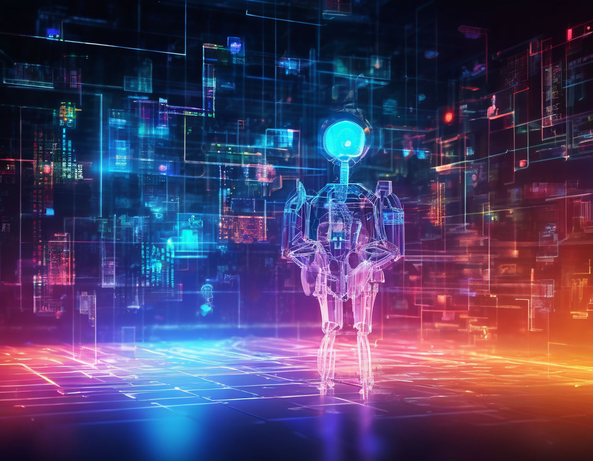

import {Principles} from "@/components/Principles";
import {FeatureListItem, FeaturesList} from "@/components/FeaturesList";
import {
    AcademicCapIcon,
    DocumentTextIcon,
    ServerStackIcon,
    TicketIcon,
    StarIcon
} from '@heroicons/react/24/outline';

export const service = {
    active: true,
    title: 'Внедрение AI',
    subtitle: 'Использование искусственного интеллекта, машинного обучения и компьютерного зрения для распознавания событий и выполнения управляющих воздействий.',
    description:
        'Использование искусственного интеллекта, машинного обучения и компьютерного зрения для распознавания событий и выполнения управляющих воздействий.',
    sort: 5,
    icon:  StarIcon,
}

export const metadata = {
    title: 'Внедрение AI',
    description: 'Использование искусственного интеллекта, машинного обучения и компьютерного зрения для распознавания событий и выполнения управляющих воздействий.',
}

Использование искусственного интеллекта (ИИ) для автоматизации бизнеса открывает новые горизонты для различных отраслей.
Одним из основных преимуществ является повышение эффективности процессов.
Автоматизация рутинных задач позволяет сотрудникам сосредоточиться на более сложных и креативных аспектах работы,
что в свою очередь способствует инновациям и повышению производительности.

Мы предлагаем комплексный подход к внедрению ИИ, который включает:

<FeaturesList title="" className="lg:grid-cols-2">
    <FeatureListItem title="Анализ текущих бизнес процессов" icon={DocumentTextIcon}>
        Важно выявить области, где ИИ может значительно повысить продуктивность и оптимизировать операции. Это позволяет определить приоритеты и установить четкие цели для внедрения технологии.
    </FeatureListItem>
    <FeatureListItem title="Разработка стратегии" icon={ServerStackIcon}>
        На этом этапе важно сформировать четкое видение того, каким образом ИИ будет интегрирован в существующие системы. Необходимо учитывать как технические, так и организационные аспекты, включая обучение сотрудников и изменение корпоративной культуры.
    </FeatureListItem>
    <FeatureListItem title="Пилотное тестирование" icon={TicketIcon}>
        Проведение экспериментов на небольших выборках позволяет выявить возможные проблемы и недочеты в процессе интеграции ИИ, а также оценить его эффективность. Полученные данные помогут внести необходимые коррективы.
    </FeatureListItem>
    <FeatureListItem title="Масштабирование и мониторинг" icon={AcademicCapIcon}>
        После успешного пилотирования следует внедрять ИИ на более широкий масштаб, постоянно отслеживая результаты и обновляя системы в соответствии с новыми технологическими тенденциями. Такой подход позволит достичь максимальной эффективности и долгосрочных результатов.
    </FeatureListItem>
</FeaturesList>

**Преимущества использования ИИ:**

* **Увеличение эффективности:** Искусственный интеллект позволяет автоматизировать рутинные задачи, что значительно сокращает время обработки информации. Это освобождает сотрудников для более творческих и стратегических задач, тем самым повышая общую продуктивность бизнеса.
* **Снижение затрат:** Внедрение ИИ-технологий позволяет компаниям снизить операционные расходы. Автоматизация процессов уменьшает риск ошибок, минимизируя связанные с ними затраты, а также сокращает потребность в большом количестве ручной работы.
* **Улучшение обслуживания клиентов:** С помощью ИИ компании могут предложить персонализированный подход к каждому клиенту, анализируя его предпочтения и поведение. Чат-боты и виртуальные ассистенты обеспечивают круглосуточную поддержку, что повышает уровень удовлетворенности клиентов.
* **Анализ данных и прогнозирование:** ИИ способен обрабатывать большие объемы данных и выявлять скрытые закономерности. Это позволяет компаниям делать более точные прогнозы и принимать обоснованные решения, основанные на фактических данных.
* **Гибкость и масштабируемость:** Использование ИИ облегчает быстрое адаптирование бизнес-процессов под изменяющиеся условия рынка. Компании могут легко масштабировать свои операции, интегрируя новые технологии без значительных затрат ресурсов.

Наша команда экспертов готова помочь вам внедрить ИИ в вашем бизнесе. Свяжитесь с нами сегодня, чтобы узнать, как мы можем помочь вам воплотить вашу идею в жизнь.

<Principles/>

