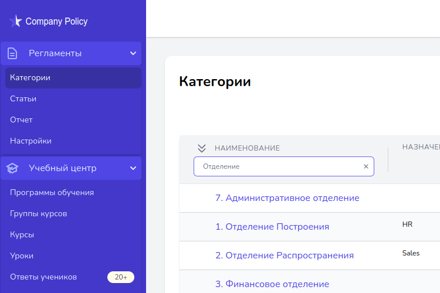

import logo from '@/images/clients/org-online/logo_op3.svg'
import imageHero from './hero.png'

export const caseStudy = {
  active: true,
  client: 'Оргполитика',
  title: 'Оргполитика',
  description:
    'Оргполитика - приложение для цифровизации бизнес процессов компании. Включает в себя Учебный центр организации, Систему Регламентов, Оргструктуру, Статистики и прочее.',
  summary: [
    'Оргполитика - приложение для цифровизации некоторых бизнес процессов компании. Включает в себя Учебный центр организации, Систему Регламентов, Оргструктуру, Статистики и прочее.',
    'Приложение позволяет ускорить обучение сотрудников, распространение приказов и регламентов и другое.'
  ],
  logo,
  image: { src: imageHero },
  date: '2023-10',
  service: 'Веб-разработка, LMS',
/*
  testimonial: {
    author: { name: 'Torben S.', role: 'Руководитель отдела продаж' },
    content:
      'Работая со IT-DELTA, мы почувствовали себя скорее партнером, чем заказчиком. Они действительно погружаются в наши проблемы и предлагают оригинальные и эффективные решения.',
  },
*/
}

export const metadata = {
  title: `Проект ${caseStudy.client}`,
  description: caseStudy.description,
}

## Описание проекта

Цель проекта - создание бизнес-платформы для малого и среднего бизнеса, позволяющей автоматизировать процессы обучения персонала (LMS система), ознакомления с регламентами, иерархией подчиненности, KPI и прочие управленческие инструменты.

### Функции системы

* система авторизации пользователей, профиль пользователя, восстановление пароля;
* авторизация пользователей по технологии OAuth2 с помощью провайдеров аутентификации Facebook, Bitrix24 и пр.;
* система приглашения пользователей по email;
* мощная система разграничения прав доступа по технологии ABAC на базе промышленного решения Casbin.org;
* система мультитенантности, позволяющая изолировать базы данных разных организаций;
* система управления очередями для ускорения отклика системы на ресурсоёмких операциях;
* система управления регламентными заданиями, выполняемыми по расписанию;
* система уведомления пользователей о событиях с помощью email;
* подсистема хранения файлов с возможностью хранения на S3;
* интеграция с системами оплаты Сбербанк Pay, Stripe;
* генерация отчетов и сохранение в формате pdf, doc;
* система автоматического резервного копирования.

## Технологии

<TagList>
  <TagListItem>Frontend (React.js)</TagListItem>
  <TagListItem>Backend (Laravel)</TagListItem>
  <TagListItem>Automated testing (E2E, Cypress, Allure)</TagListItem>
  <TagListItem>Infrastructure (AWS)</TagListItem>
  <TagListItem>E-mail integration (MailJet)</TagListItem>
  <TagListItem>Bitrx24 integration</TagListItem>
</TagList>

[comment]: <> (<Blockquote)

[comment]: <> (  author={{ name: 'Torben S.', role: 'Руководитель отдела продаж' }})

[comment]: <> (  image={{ src: imageTobenS }})

[comment]: <> (>)

[comment]: <> (  Работая со IT-DELTA, мы почувствовали себя скорее партнером, чем заказчиком. )

[comment]: <> (  Они действительно погружаются в наши проблемы и )

[comment]: <> (  предлагают оригинальные и эффективные решения.)

[comment]: <> (</Blockquote>)

[comment]: <> (<StatList>)

[comment]: <> (  <StatListItem value="25%" label="Less traffic" />)

[comment]: <> (  <StatListItem value="10x" label="Page load times" />)

[comment]: <> (  <StatListItem value="15%" label="Higher infra costs" />)

[comment]: <> (  <StatListItem value="$1.2M" label="Legal fees" />)

[comment]: <> (</StatList>)
